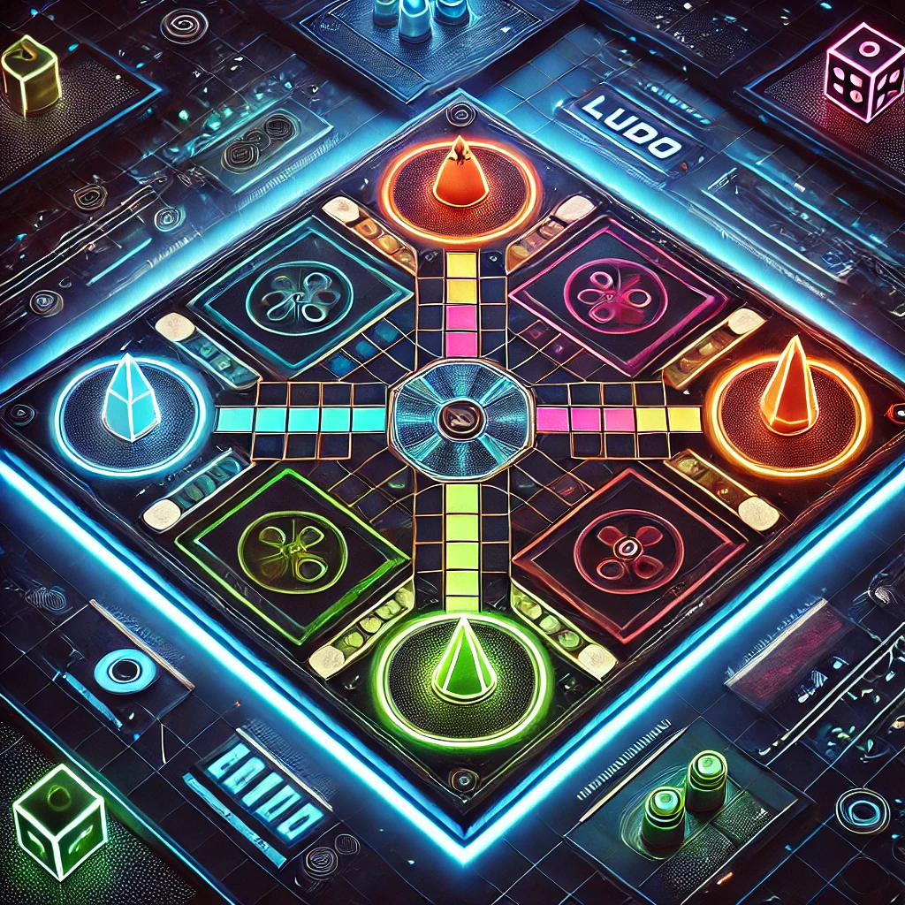
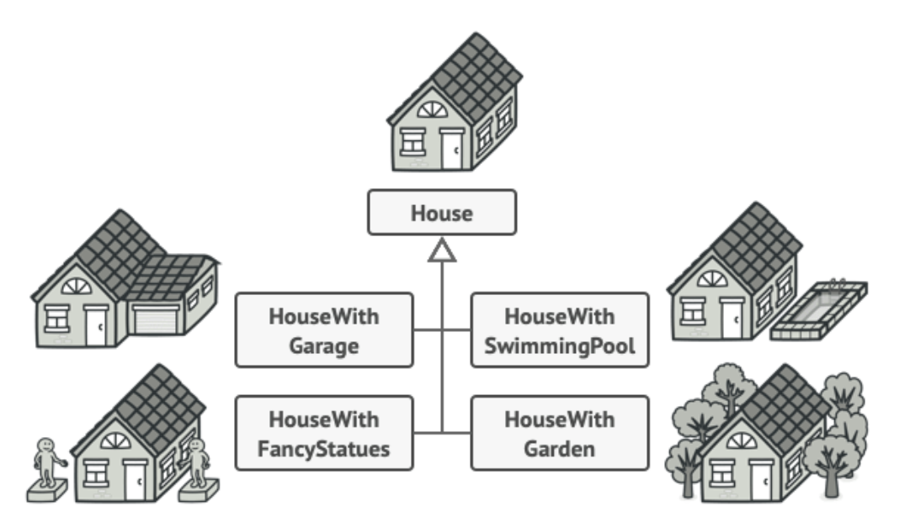
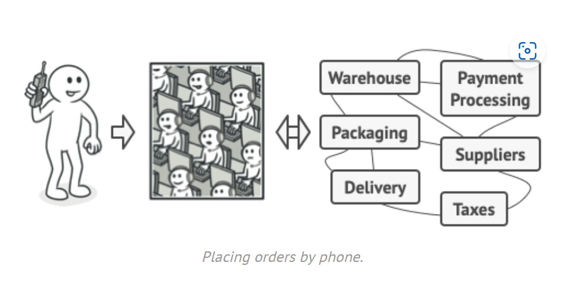
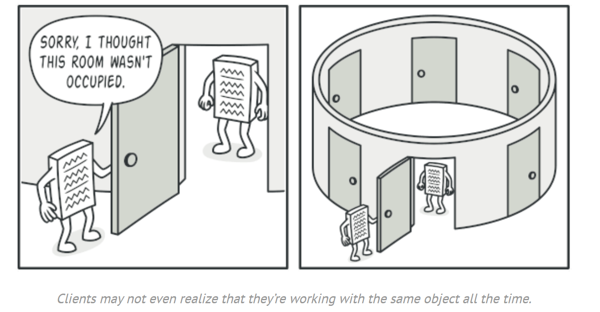

# Console Ludo Game

 - The game repository: [Java Ludo](https://github.com/4ushkopeka/Java-Ludo)

## Table of Contents
- [About Us and the Project](#about-us-and-the-project)
- [Game Rules](#game-rules)
- [Implemented Design Patterns](#implemented-design-patterns)
    - [Adapter Design Pattern](#adapter-design-pattern)
    - [Builder Design Pattern](#builder-design-pattern)
    - [Facade Design Pattern](#facade-design-pattern)
    - [Dice Singleton Pattern](#dice-singleton-pattern)
    - [Visitor Pattern in the Game](#visitor-pattern-in-the-game)
- [How to Run](#how-to-run)
- [Authors](#authors)
- [License](#license)

## About us and the project
We, **Georgi Chitarliev** and **Silvia Popova**, are software engineering students who created a **console-based Ludo game in Java**. This project demonstrates object-oriented programming principles and implements several **design patterns** to ensure modularity, scalability, and maintainability.

---

## Game Rules
- Players roll dice to move their symbols on the board.
- Reaching a ⏹️ (goal tile) earns a point and allows rolling the dice again.
- A player who lands on a tile occupied by another player sends them back to their base and retains the spot, earning another roll.
- ⬛ (safe tiles) protect players from being kicked back.
- Rolling a **6** grants another turn.
- Players must roll a **6** to move out of their base.
- The first player to move all symbols to the goal wins.

---

## Adapter Design Pattern

### What is an Adapter?
The **Adapter Pattern** is a **structural design pattern** that allows objects with incompatible interfaces to work together. It acts as a bridge between the two interfaces by converting one interface into another that the client expects.

### Why We Used It
In our project, the **Adapter Pattern** was implemented to ensure flexibility between the **console-based interface** and the **game logic**. This separation simplifies unit testing, improves reusability, and supports the addition of new input/output systems without modifying the core game logic.

### Implementation Overview
- **ConsoleAdapter.java** serves as the adapter, translating method calls between the **IGameConsole** interface and the console's specific implementation.
- **IGameConsole.java** defines the required methods for input and output operations.
- The **ConsoleAdapter** class implements **IGameConsole**, providing methods such as `print()` and `readInput()` to interact with users via the console.

---

## Builder Design Pattern
### What is a Builder?
The Builder Pattern is a creational design pattern that separates the construction of a complex object from its representation. It provides a step-by-step approach to building an object.

###  Why We Used It
In our project, the Builder Pattern is used to simplify the creation and initialization of the game board. Instead of leaving the complex board setup logic in the GameEngine, we use a dedicated BoardBuilder class to construct the board in a modular and reusable way. 
Shortly, the GameEngine delegates board construction to the BoardBuilder, making the engine focused on gameplay logic.

### Implementation Overview
**BoardBuilder.java**:
- A dedicated builder class to construct the board step by step.
- It includes methods for initializing bases, rows, columns, and special tiles.

**GameEngine.java**:
- The engine uses the BoardBuilder to create the game board, ensuring the engine code remains clean and focused.

---

## Facade Design Pattern
### What is it?
The Facade Design Pattern is a structural design pattern that provides a unified and simplified interface to a set of interfaces in a subsystem. It acts as a facade, or front-facing interface, to hide the complexities of the underlying subsystem and provide a cleaner, more user-friendly API.

### Why Use it?
In this project, the Facade Design Pattern is used to encapsulate the complexities of managing the game board. Using the Facade has the following benefits:
- It keeps the Game and GameEngine classes focused on game flow rather than board operations.
- It hides the details of BoardBuilder and BoardModifier from the main game classes, improving modularity.
- It also allows changes to the board logic can be confined to the BoardFacade and its associated classes, minimizing the impact on the rest of the codebase.

### Implementation Overview
The GameEngine class delegates all board-related operations to the BoardFacade.
The Game class uses the BoardFacade for board initialization and modification, ensuring that the game flow remains decoupled from board management.
How It Works in the Project
Board Initialization:

The GameEngine calls BoardFacade.initializeBoard() to create the board with all its components using the BoardBuilder.

During gameplay, the Game class calls BoardFacade.modifyBoard() to update the board based on symbol movements and player actions. This ensures the board reflects the current game state.

The Game class retrieves the current board state using BoardFacade.getBoard() and passes it to the ConsoleAdapter for display.

---

## Dice Singleton Pattern
### What is the Singleton Pattern?
The Singleton Pattern is a creational design pattern that ensures a class has only one instance while providing a global access point to it. This pattern is particularly useful when exactly one object is required to coordinate actions across the system.

### Why Use the Singleton Pattern for Dice?
In our Ludo game, the dice plays a central role in determining the gameplay dynamics.
All players share the same source of randomness - uniform gameplay behavior.
This singleton class also eliminates the need to create multiple Random objects, optimizing memory usage and performance. Furthermore, 
the dice can be easily accessed and controlled globally, simplifying the game logic.

### Implementation Overview
The Dice class is implemented as a singleton, ensuring that there is only one instance of the dice shared across the game. Generally how it works:

* Its constructor is private to prevent direct instantiation of the class.
* A static variable holds the single instance of the class.
* A getInstance method provides a way to access the instance.
* The singleton uses a Random object to generate dice rolls consistently.

---

## Visitor Pattern in the Game
### What is it?
The Visitor pattern is a behavioral design pattern that lets you separate algorithms from the objects on which they operate. It introduces a way to perform operations on elements of an object structure without modifying their classes.

### Why Use it?
The visitor design pattern keeps core classes like IPlayer and ISymbol focused on their responsibilities by moving operation logic to separate visitor classes.
New operations can be added without altering the core classes.
It also enables different operations to be performed on the same objects in a flexible way.
In our case, the visitor is used during operations like calculating scores for all players.

### Implementation Overview
* Visitor Interface - Defines methods for visiting different types of elements, such as IPlayer and ISymbol.
* Concrete Visitors - Implement specific operations, like calculating total scores (ScoreCalculatorVisitor) or checking player states (StateCheckerVisitor).
* Accept Method - Added to IPlayer and ISymbol interfaces to allow them to accept a Visitor.

---

## How to Run
1. Clone this repository.  
2. Open the project in **IntelliJ IDEA** or any other IDE.  
3. Mark `src/` as the source root under **File > Project Structure > Modules > Sources**.  
4. Build and run the project.  

---

## Authors
- **Georgi Chitarliev** - [GitHub Profile](https://github.com/4ushkopeka)  
- **Silvia Popova** - [GitHub Profile](https://github.com/popo0015)  

---

## License
This project is licensed under the MIT License.