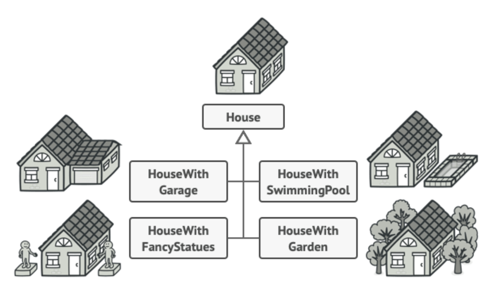

# Console Ludo Game

## About us and the project
We, **Georgi Chitarliev** and **Silvia Popova**, are software engineering students who created a **console-based Ludo game in Java**. This project demonstrates object-oriented programming principles and implements several **design patterns** to ensure modularity, scalability, and maintainability.

---

## Game Rules
- Players roll dice to move their symbols on the board.
- Reaching a ⏹️ (goal tile) earns a point and allows rolling the dice again.
- A player who lands on a tile occupied by another player sends them back to their base and retains the spot, earning another roll.
- ⬛ (safe tiles) protect players from being kicked back.
- Rolling a **6** grants another turn.
- Players must roll a **6** to move out of their base.
- The first player to move all symbols to the goal wins.

---

## Implemented Design Patterns
Our project currently implements several **design patterns**, starting with the **Adapter Pattern**. More patterns will be added, including **Behavioral**, **Structural**, and **Creational** types.

---

## Adapter Design Pattern

### What is an Adapter?
The **Adapter Pattern** is a **structural design pattern** that allows objects with incompatible interfaces to work together. It acts as a bridge between the two interfaces by converting one interface into another that the client expects.


### Why We Used It
In our project, the **Adapter Pattern** was implemented to ensure flexibility between the **console-based interface** and the **game logic**. This separation simplifies unit testing, improves reusability, and supports the addition of new input/output systems without modifying the core game logic.

### Implementation Overview
- **ConsoleAdapter.java** serves as the adapter, translating method calls between the **IGameConsole** interface and the console's specific implementation.
- **IGameConsole.java** defines the required methods for input and output operations.
- The **ConsoleAdapter** class implements **IGameConsole**, providing methods such as `print()` and `readInput()` to interact with users via the console.

### Code Example
```java

```

---

## Builder Design Pattern
### What is a Builder?
The Builder Pattern is a creational design pattern that separates the construction of a complex object from its representation. It provides a step-by-step approach to building an object.



###  Why We Used It
In our project, the Builder Pattern is used to simplify the creation and initialization of the game board. Instead of leaving the complex board setup logic in the GameEngine, we use a dedicated BoardBuilder class to construct the board in a modular and reusable way. 
Shortly, the GameEngine delegates board construction to the BoardBuilder, making the engine focused on gameplay logic.

### Implementation Overview
**BoardBuilder.java**:
- A dedicated builder class to construct the board step by step.
- It includes methods for initializing bases, rows, columns, and special tiles.

**GameEngine.java**:
- The engine uses the BoardBuilder to create the game board, ensuring the engine code remains clean and focused.

### Code Example
Using the Builder in GameEngine
```java
protected void initializeBoard(int players) {
if (players < 2 || players > 4) {
console.print("Invalid number of players!");
console.print("Game is closing.");
System.exit(0);
}

    BoardBuilder builder = new BoardBuilder();
    board = builder
        .initialize(15)
        .initializeBases(players)
        .initializeCommonRows()
        .initializeCenter()
        .initializeCommonColumns()
        .initializeSpecialTiles()
        .build();
}
```

---

## Upcoming Design Patterns
We plan to implement the following patterns:
1. **State Pattern** *(Behavioral)* - To handle different player states such as "waiting," "rolling dice," and "moving pieces."  
2. **Builder Pattern** *(Creational)* - To simplify the creation of complex board configurations and setups.  
3. **Observer Pattern** *(Behavioral)* - To manage notifications for player actions and game events.  
4. **Singleton Pattern** *(Creational)* - To ensure a single instance of the **GameEngine**.  
5. **Composite Pattern** *(Structural)* - To group and manipulate board elements like symbols and tiles uniformly.  

---

## How to Run
1. Clone this repository.  
2. Open the project in **IntelliJ IDEA** or any other IDE.  
3. Mark `src/` as the source root under **File > Project Structure > Modules > Sources**.  
4. Build and run the project.  

---

## Authors
- **Georgi Chitarliev** - [GitHub Profile](https://github.com/4ushkopeka)  
- **Silvia Popova** - [GitHub Profile](https://github.com/popo0015)  

---

## License
This project is licensed under the MIT License.